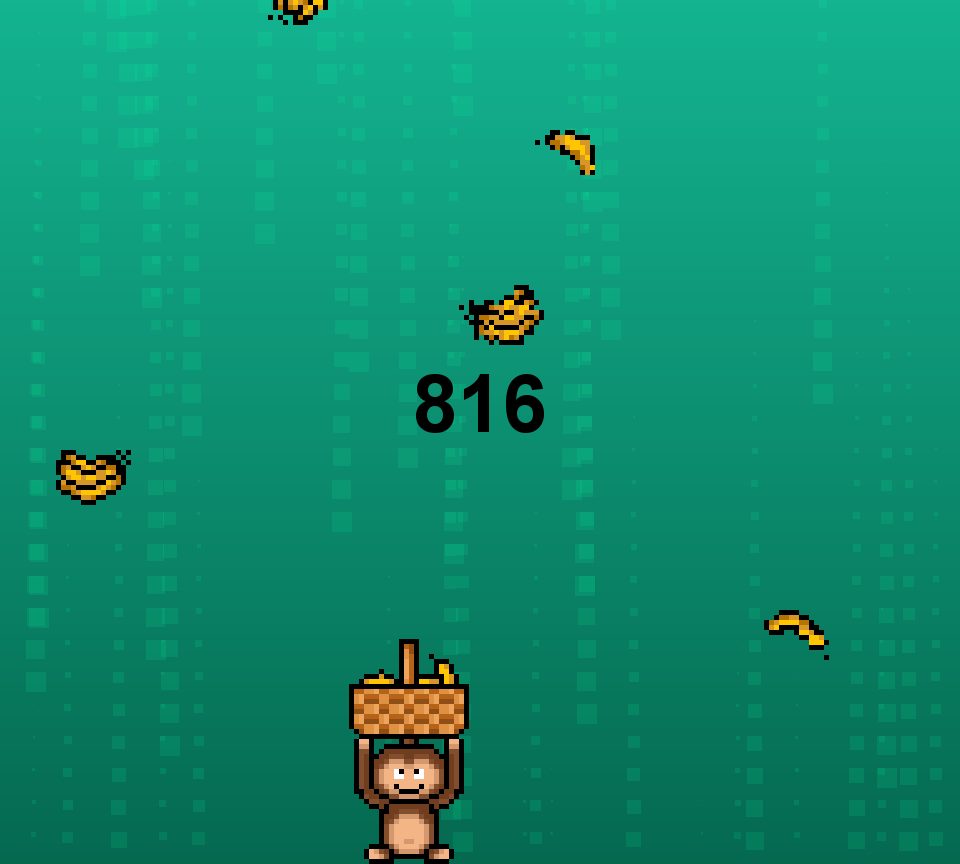

# 🐒🍌 Monkey Banana Catch!

## 📌 Project Title
Monkey Banana Catch!

## 📝 Description
A simple 2D Java game about a monkey catching bananas falling from the sky, with a graphical user interface. The objective is to have the highest score possible.

### 🌟 Key Features

- **Main menu:** The game starts in this menu.
- **Game screen:** Place where the game will be drawn 
- **Collision detection:** Each time the monkey touches a banana, score increases
- **Score counter:** Displays player's score
- **Statistics:** Allows the player to compare themselves

### 🖼 Example Gameplay
<div align="center">

</div>

## 🎮 Controls

- **A key:** Moves player left
- **D key:** Moves player right

## 🧪 Requirements for compilation

- IntelliJ IDEA 2024.2.1
- Oracle OpenJDK 22.0.1

## ⚙ Requirements for running

- [Java 22.0.1 (2024-04-16)](https://www.oracle.com/java/technologies/downloads/)

```batch
javaw -jar game.jar
```